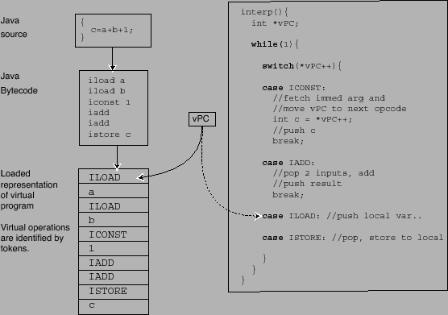
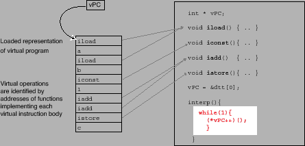
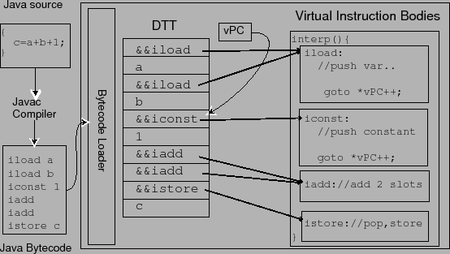

# Các kĩ thuật dispatch trong interpreter
#intepreter #virtual-machine

Trước khi chém gì thì định nghĩa phát đã.

Trong [cái paper này](http://www.cs.toronto.edu/~matz/dissertation/matzDissertation-latex2html/node6.html), dispatch được định nghĩa như sau:

> We defined dispatch as the mechanism used by a high level language virtual machine to transfer control from the code to emulate one virtual instruction to the next.

## Switch dispatch
Mã giả như vầy: ta có `vPC` là một cái biến chứa tập instructions.

- `vPC` sẽ tăng lên để nhảy đến instruction tiếp theo
- nếu cần branching có thể được thực hiện trong instructions (gán `vPC` thành cái khác)
- 

- Phương thức dispatch đơn giản nhất.
- **Cũng là chậm nhất**, vì overhead của dispatch loop và câu lệnh `switch`.
- Được dùng khá nhiều, ví dụ trong JavaScript và Python interpreter (🧠 không biết còn đúng không).

## Direct Call Threading
Mỗi instruction được viết thành một hàm và dispatch dùng function pointer (`vPC` lúc này là cái function pointer).

- mình dùng **cái address của function** để lấy function body thay vì xài 1 cái mapping table như switch-based dispatching ở trên.
- Mặc dù có tên là "direct", nó thực ra là một cái *indirect* function call (bạn phải gọi thông qua một cái function signature).
- Khác với direct threading ở dưới.

## Direct Threading

* Giống như direct call threading, chương trình được load vào interpreter là một cái Direct Threading Table (DTT) - một list *body address và toán tử (operands)*.
* direct-threaded interpreter không cần vòng lặp while. Trong mỗi hàm ta thấy `goto *vPC++` sẽ đưa ta tới instruction label tiếp theo.
* như vậy ta có ít (assembly) instruction hơn và nhanh hơn switch-based hay direct call threading dispatching.