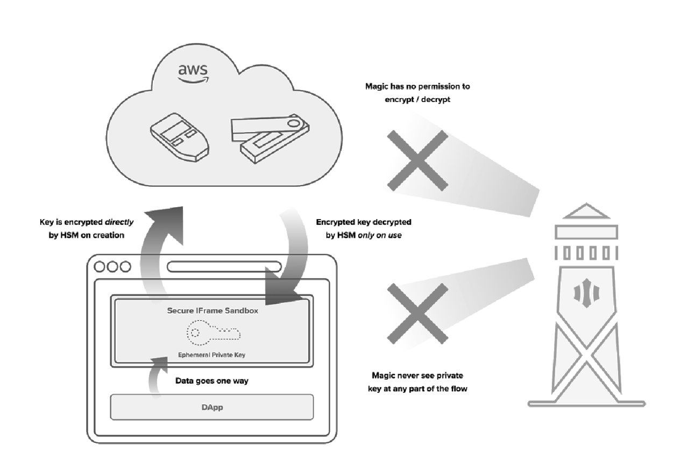

# Magic: A Key-Based Authentication System For Self-Sovereign Identity

Link bài báo: https://www.dropbox.com/s/3flqaszoigwis5b/Magic%20Whitepaper.pdf?dl=0
#technical #magic #blockchain #authentication #security

## Dài quá không đọc

- Magic là một giải pháp quản lý danh tính người dùng (user identity management solution) dựa trên mã hoá khoá công khai.
- Nó được xây dựng dựa trên chuẩn Decentralized Identity (DID), với người dùng được danh tính dựa vào public-private key pairs của blockchain.
	- **passwordless**: xác thực (authenticate) người dùng mà không cần họ nhập mật khẩu
	- **platform-independent**: dựa vào mạng lưới blockchain phi tập trung. Không bị vendor lock-in vào Magic hay bất kì một provider nào.
- Tóm lại, Magic nói rằng Magic xịn.

## Giới thiệu
Cũng giống như mấy bác tài công nghệ Grab chê mấy anh xe ôm truyền thống sao mấy anh truyền thống quá, Magic cũng mở màn bằng cách dìm hàng phương thức authenticate bằng mật khẩu:

- Mật khẩu kém chiếm 81% các lỗ hổng an ninh, vì 59% người dùng xài lại mật khẩu => $240k cho mỗi 1000 record (🧠 đưa số có đưa link, link chưa kiểm chứng)
- Nhiều công ty lớn cũng từng bị hack mật khẩu
- Khi mật khẩu bị hack -> hacker sẽ crack mật khẩu -> xài mật khẩu đó cho tài khoản ngân hàng -> impact to.
- Tới 50% support ticket đều liên quan tới mật khẩu. Mỗi ticket tốn $70 (🧠 đưa số có đưa link, link chưa kiểm chứng)

Tóm lại Magic cho rằng bạn nên xài một giải pháp nào đó không dùng password.

## Kiến trúc

Văn mẫu về cách tấn công đánh cắp dữ liệu:

1. Recon: Attacker nghiên cứu, tạo hồ sơ về công ty victim.
2. Infiltrate: Attacker xâm nhập vào hệ thống tổ chức.
3. Discover: Khi đã ở trong, attacker sẽ khám phá thêm về hệ thống.
4. Capture: Attacker chiếm lấy những dữ liệu có giá trị (mật khẩu)
5. Exfiltrate: Attacker chuyển những dữ liệu đó ra ngoài, dùng tài nguyên offline để crack chúng.
6. Monetize: Attacker bán hoặc dùng dữ liệu crack được để tống tiền.

Mọi thứ có thể càng xấu hơn vì dữ liệu mã hoá có thể được crack offline -> victim có thể sẽ còn không biết mình đã bị hack.

(🧠... bỗng dưng nghĩ đến vụ hack của mấy anh BKAV)

### Zero-knowledge authentication

- Thao tác authenticate bao gồm: server gửi challenge, user đáp trả challenge. Password authentication thì challenge là mật khẩu.
- Người dùng có thể chứng minh tôi sở hữu cái private key của tôi, mà không cần phải tiết lộ cái private key:
	- dùng signature.
	- không còn phải gửi mật khẩu để đáp trả challenge.

### Decentralized Identity Token

- Người dùng sinh ra một cái stateless token biểu thị danh tính có thể được xác minh -> Decentralized Identity Token (DIDT).
- DIDT hao hao như JWT dựa trên DID protocol. Token bao gồm 2 thông tin:
	- Chữ ký Elliptic Curve của dữ liệu chứa trong token.
	- Plaintext data: dữ liệu chứa trong token
- Dữ liệu trong token bao gồm nhiều thứ không tiện liệt kê ra hết, chủ yếu gồm:
	- mấy field liên quan tới thời gian (khi nào activate, khi nào đáo hạn)
	- mấy field liên quan tới danh tính (tôi là ai)
- Khác so với JWT:
	- JWT do một centralized provider cung cấp.
	- DIDT do chính người dùng, sử dụng private key của mình, cung cấp.
- Cách duy nhất để phá được DIDT là tìm được lỗ hổng toán học của Elliptic Curve cryptography.

Như vậy ta đã biết server sẽ xác minh người dùng như thế nào. Tuy nhiên câu hỏi đặt ra là private key sẽ được quản lý ra sao.

### Delegated Key Management
#### Hardware Security Module
- Dựa vào Hardware Security Module (HSM) của AWS Key Management System (KMS)
	- HSM là một cái cloud-based hardware security module cho phép bạn tạo và sử dụng encryption key trên AWS Cloud.
	- Master key của người dùng lưu dưới dạng AES256 trên HSM.
	- Như YubiKeys hay hard-ware based wallets, key KHÔNG bao giờ đi ra khỏi hardware.
- Private key được mã hoá bằng master key lưu trên AWS KMS HSM
	- Attacker cần phải access được hardware để tấn công
	- Attacker chỉ có thể tấn công trong môi trường "hostile" của Magic -> cho phép detect, mitigate ...
#### Non-Custodial

- Private keys của người dùng không được "thấy" bởi Magic
- Encryption và decryption được thực hiện bởi AWS KMS (HSM) kết hợp với AWS Cognito.

### Data flow với AWS

- Đầu tiên, người dùng sẽ xác minh bản thân với Magic auth layer
	- Magic gửi link tới hộp thư của người dùng.
	- Người dùng click vào link để authenticate
- Sau khi authenticate, người dùng nhận được một access token (time-bound)
	- đổi token lấy scoped credentials để tương tác thẳng với AWS.
	- gọi HSM để thao tác với master key.
	- access token hoặc scoped credentials đều được sinh bởi AWS, được audit log và có TTL.
	- => Tóm lại, Magic nói Magic không thể chặn hoặc làm giả trong cái luồng này.
- Khi người dùng sign-up:
	1. Browser của họ tạo ra một cái javascript iframe. App không truy cập được vào cái iframe này.
	2. Trong cái iframe sẽ sinh ra một cái public-private key pair.
	3. Private key được encrypt bởi cái flow Delegated Key Management đã được kể ở trên.
	4. Encrypted key sẽ được lưu trong iframe, đồng thời upload lên Magic
	5. Magic xoá permision của bản thân vô KMS, để đảm bảo mình không decrypt cái key được (🧠 ủa vậy sau này Magic add lại được không?)
	6. Nếu người dùng đăng nhập lại, cái encrypted key sẽ được download xuống.

### Phishing Protection

- Passwordless Authentication:
	- Vì không có mật khẩu nên người dùng không thể lừa mật khẩu được.
	- Người dùng được gửi cho cái link, sau khi click cái link thì credentials được load trong cái iframe.
	- Nếu cái link đó bị ăn cắp thì sao?
		- Token trong email chỉ xài được cho đúng cái device đã khởi tạo login
		- Attacker cần chạm được vô máy tính + mailbox thì mới làm ăn được.
- Domain whitelisting:
	- Attacker có thể clone một trang web giống của bạn
	- Magic cho phép khách hàng whitelist domains.
- CSRF và XSS
	- Tóm lại Magic nói rằng Magic cố gắng không bị XSS. Thật là magic.
- E2E TLS Encryption
- Network setup: mỗi môi trường nằm trên một VPC khác nhau.
- Intrusion Detection Setup
- Data Encryption At Rest

## Tóm lại
- Magic cho rằng danh tính là bài toán tiên quyết của Internet
- Các công ty lớn như Google, Facebook với danh tính tập trung đang chiếm ưu thế. Hoàn toàn dựa vào họ sẽ ảnh hưởng đến sự sống còn của business.
- Tự build giải pháp danh tính thì cũng khó. Tóm lại là nên xài Magic.
- Dùng Magic đi Magic xịn lắm:
	- danh tính "phi tập trung"
	- thay vì dựa token vào một nhà cung cấp danh tính tập trung, người dùng tự sinh token cho mình
	- người dùng không cần tự lưu private key

## Nói thêm chút về DID
Địa chỉ chứa DID của Ethereum
0xdca7ef03e98e0dc2b855be647c39abe984fcf21bp